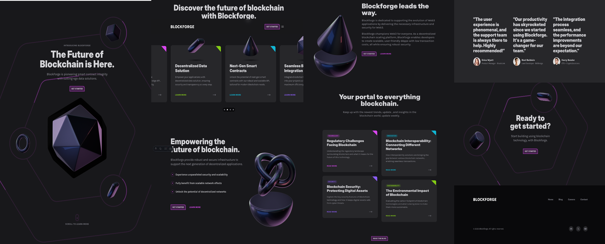

<div align="center">

# 🚀 Blockforge — Modern SaaS Blockchain Landing Page

Elegant, animated, and developer-friendly landing page for a modern blockchain startup, built with Astro, TailwindCSS, TypeScript, and Framer Motion.

</div>

---

<div align="center">

### 🛠 Built With

[](https://astro.build/)
[](https://www.typescriptlang.org/)
[](https://tailwindcss.com/)
[](https://www.framer.com/motion/)

</div>

---

## 🧠 Overview

**Blockforge** is a fully responsive and animated SaaS landing page tailored for modern Web3 startups.  
It highlights features, blog posts, job listings, and interactive elements — all built with a clean and scalable structure.

Inspired by [Frontend Tribe’s YouTube](https://www.youtube.com/@frontend-tribe), this project is ideal for developers looking to practice Astro + TailwindCSS while building something visually striking.

---

## 📸 Demo



---

### 🔍 Highlights

- ✅ Fully responsive design with animated mobile navigation
- ✅ Framer Motion scroll animations for 3D visuals and sections
- ✅ Reusable and well-documented UI components (Card, Circle, Tag, etc.)
- ✅ Astro content collections for blog posts and career listings
- ✅ Modern, scalable codebase with Tailwind + TypeScript + Astro
- ✅ Beautiful 3D illustrations and interactive call-to-action areas
- ✅ Clean layout structure and modular file organization

---

## ✨ Features

- 🎯 Engaging scroll-triggered animations powered by Framer Motion
- 🧩 Component-driven architecture built for easy customization
- 📝 Content-managed blog & careers powered by Astro's collections API
- 📱 Designed mobile-first with smooth, performant UI interactions
- 🎨 Custom visuals, 3D assets, and Tailwind-based styling framework
- 🧠 Developer-friendly structure with full TypeScript + documentation

---

## 📦 Project Structure

```bash
📁 src/
├── components/        # Reusable UI (Card, Circle, Tag, etc.)
├── sections/          # Page sections (Hero, Features, Testimonials, etc.)
├── layouts/           # Default layout
├── content/
│   ├── blog/          # Markdown blog posts
│   └── positions/     # Job listings
└── pages/             # Astro routes (index, blog, careers, contact)

📄 astro.config.mjs
📄 tailwind.config.ts
📄 tsconfig.json
```

---

## 🚀 Getting Started

### 1. Clone the repo

```bash
git clone https://github.com/Oran01/blockforge-landing.git
cd blockforge-landing
```

### 2. Install dependencies

```bash
npm install
```

### 3. Start the development server

```bash
npm run dev
```

### 4. Then open http://localhost:4321 in your browser

---

## ▶️ Tutorial Followed

This project was built following this excellent walkthrough on YouTube:

- [Frontend Tribe – Pro-Level Dark Mode SaaS Website](https://www.youtube.com/watch?v=ZFJZiwiYZBc&t=27602s)

---

## 🤝 Contributing

Feel free to fork this repository and submit pull requests to improve the project!

---

🌟 Star this repo if you found it useful! ⭐
